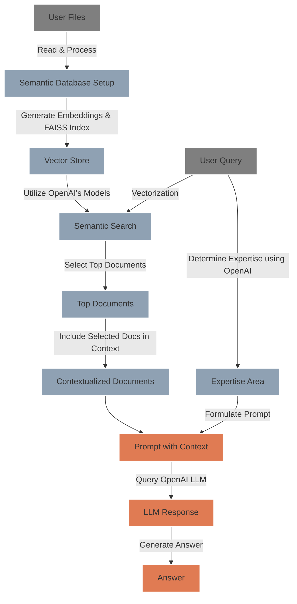

# 🤖 `LLM` RAG 

## 🌟 Overview 
This is a Streamlit app leveraging a RAG (Retrieval-Augmented Generation) Language Model (LLM) with FAISS to offer answers from uploaded markdown files 📂. The app allows users to upload files, ask questions related to the content of these files, and receive relevant answers generated by the RAG LLM 📚.

## 🛠️ System Architecture
The following diagram illustrates the flow of data through the system:



## Project Structure 🏗️
The project structure is organized as follows, ensuring modularity and ease of maintenance:

```
LLM-RAG/
│
├── src/                        # Source code for the application
│   │
│   ├── models/                 
│   │   ├── inference.py        # ModelInferenceManager class
│   │   └── vectorization.py    # SemanticVectorizer class
│   │
│   ├── pipelines/              # Pipeline for processing queries
│   │   └── query_pipeline.py   # QueryPipeline class
│   │
│   ├── utils/                  # Utility functions and classes
│   │   └── utils.py            # Helper functions, e.g., for loading configs
│   │
│   └── __init__.py             # Makes src a Python module
│
├── configs/                    # Configuration files
│   └── models_config.yml       # Model configurations
│
├── data/                       # Data used by the application
│   ├── raw/                    # Raw data like markdown files
│   ├── processed/              # Processed data like embeddings
│   └── faiss_index/            # FAISS indices
│
├── notebooks/                  # Jupyter notebooks for experiments
│   └── rag_llm_experiments.ipynb
│
├── secrets/                    # Secret keys and credentials
│   └── credentials.yml         # OpenAI API credentials
│
├── app.py                      # Main Streamlit application script
├── requirements.txt            # Python dependencies for the project
├── README.md                   # Project documentation
└── .gitignore                  # Specifies files to ignore in git
```

## 🚀 Getting Started

To begin using the LLM RAG app, follow these simple steps:

1. **Clone the Repository:**
   ```
   git clone https://github.com/labrijisaad/LLM-RAG.git
   ```

2. **Create the Environment:**
   Set up your virtual environment using either venv or conda:
   ```
   # Using venv
   python -m venv env
   source env/bin/activate
   
   # Using conda
   conda create --name env_name
   conda activate env_name
   ```

3. **Install Dependencies:**
   Install the required dependencies by

 running:
   ```
   pip install -r requirements.txt
   ```

4. **Set Up OpenAI API:**
   Rename the example credentials file to `secrets/credentials.yml` and replace the placeholder key ('sk-xxx') with your actual OpenAI API key. You can obtain your API key by following the instructions provided in the [OpenAI documentation](https://platform.openai.com/docs/quickstart?context=python).
   ```
   rename secrets/credentials-example.yml secrets/credentials.yml
   ```

5. **Run the Streamlit App:**
   Launch the Streamlit app using either the provided Makefile command or directly via the Streamlit CLI:
   ```
   # Using Makefile
   make stream
   
   # Or directly
   streamlit run streamlit_app/main.py
   ```

## 🌐 Connect with me
<div align="center">
  <a href="https://www.linkedin.com/in/labrijisaad/">
    
  </a>
  <a href="https://github.com/labrijisaad">
    
  </a>
</div>
