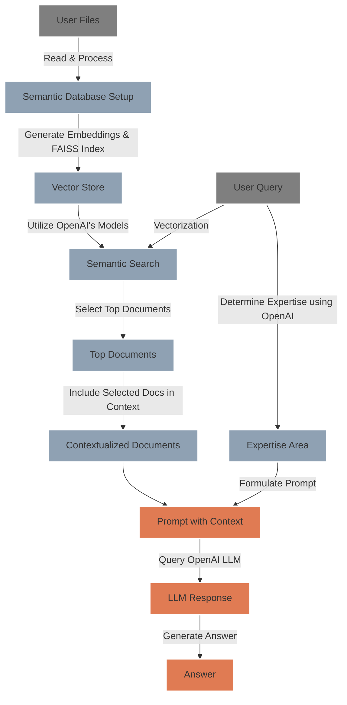

# LLM RAG ( Ongoing Project 🚧 )

## System Architecture
The following diagram illustrates the flow of data through the system:

```mermaid
graph TD
    A[User Files] -->|Read & Process| B[Semantic Database Setup]
    B -->|Generate Embeddings & FAISS Index| C[Vector Store]
    C -->|Utilize OpenAI's Models| D[Semantic Search]
    E[User Query] -->|Vectorization| D
    D -->|Select Top Documents| F[Top Documents]
    F -->|Include Selected Docs in Context| G[Contextualized Documents]
    E -->|Determine Expertise using OpenAI| H[Expertise Area]
    H -->|Formulate Prompt| I[Prompt with Context]
    G --> I
    I -->|Query OpenAI LLM| J[LLM Response]
    J -->|Generate Answer| K[Answer]

    style A fill:#7f7f7f,stroke:#fff,stroke-width:2px
    style B fill:#8fa1b3,stroke:#fff,stroke-width:2px
    style C fill:#8fa1b3,stroke:#fff,stroke-width:2px
    style D fill:#8fa1b3,stroke:#fff,stroke-width:2px
    style E fill:#7f7f7f,stroke:#fff,stroke-width:2px
    style F fill:#8fa1b3,stroke:#fff,stroke-width:2px
    style G fill:#8fa1b3,stroke:#fff,stroke-width:2px
    style H fill:#8fa1b3,stroke:#fff,stroke-width:2px
    style I fill:#e07b53,stroke:#fff,stroke-width:2px
    style J fill:#e07b53,stroke:#fff,stroke-width:2px
    style K fill:#e07b53,stroke:#fff,stroke-width:2px
```

## Connect with me 🌐

  
  

