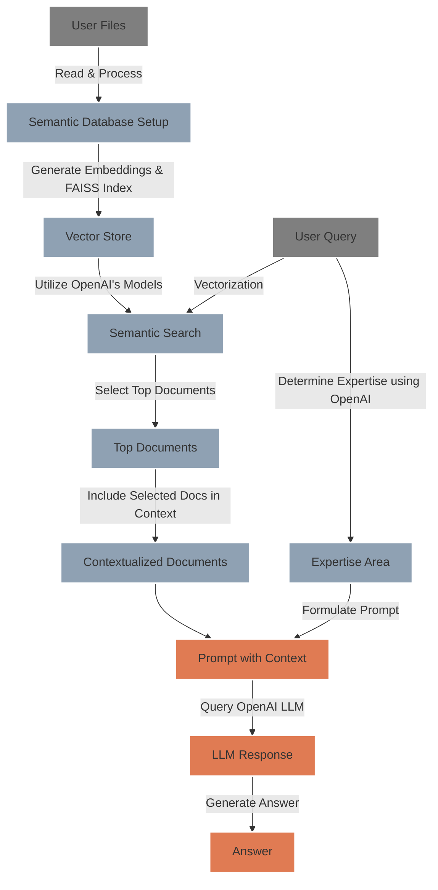

# `LLM RAG` - Streamlit RAG Language Model App 🤖

## 🌟 Overview 
This is a Streamlit app leveraging a RAG (Retrieval-Augmented Generation) Language Model (LLM) with FAISS to offer answers from uploaded markdown files 📂. The app allows users to upload files, ask questions related to the content of these files, and receive relevant answers generated by the RAG LLM 📚.

## 🛠️ System Architecture
The following diagram illustrates the flow of data through the system:



## Project Structure 🏗️
The project's main directories are laid out as follows:

```
LLM-RAG/
├── .github/workflows/          # CI/CD pipeline definitions
├── configs/                    # Configuration files for the model (model names, pricing..)
├── data/                       # Data and indices used by the app (FAISS Knowledge Base)
├── docker/                     # Docker related files 
├── notebooks/                  # Jupyter notebooks for experiments
├── secrets/                    # API keys and other secrets (excluded from version control)
├── src/                        # Source code for the LLM RAG logic
├── streamlit_app/              # Streamlit app files for the Web Interface
├── tests/                      # Test cases for the application
├── .dockerignore               # Specifies ignored files in Docker builds
├── .gitignore                  # Specifies untracked files ignored by git
├── Dockerfile                  # Dockerfile for building the Docker image
├── Makefile                    # Make commands for building and running the app 🧑‍💻
├── README.md                   # Documentation and instructions
├── requirements.txt            # Python dependencies for the project
└── (additional project files and scripts)
```

## 🚀 Getting Started

To begin using the LLM RAG app, follow these simple steps:

1. **Clone the Repository:**
   ```
   git clone https://github.com/labrijisaad/LLM-RAG.git
   ```

2. **Create the Environment:**
   Set up your virtual environment using either venv or conda:
   ```
   # Using venv
   python -m venv env
   source env/bin/activate
   
   # Using conda
   conda create --name env_name
   conda activate env_name
   ```

3. **Install Dependencies:**
   Install the required dependencies by

 running:
   ```
   pip install -r requirements.txt
   ```

4. **Set Up OpenAI API:**
   Rename the example credentials file to `secrets/credentials.yml` and replace the placeholder key ('sk-xxx') with your actual OpenAI API key. You can obtain your API key by following the instructions provided in the [OpenAI documentation](https://platform.openai.com/docs/quickstart?context=python).
   ```
   rename secrets/credentials-example.yml secrets/credentials.yml
   ```

5. **Run the Streamlit App:**
   Launch the Streamlit app using either the provided Makefile command or directly via the Streamlit CLI:
   ```
   # Using Makefile
   make stream
   
   # Or directly
   streamlit run streamlit_app/main.py
   ```
## 🐳 Docker Version
The application is available as a Docker container. To set up the Docker environment:

1. **Build the Docker Image:**
   Run `make docker-build` or use the Docker command directly:
   ```shell
   docker build -t llm_rag_app -f docker/Dockerfile .
   ```

2. **Run the Docker Container:**
   Start the container with `make docker-run` or use the Docker command:
   ```shell
   docker run -p 8501:8501 -v $(pwd)/secrets:/app/secrets llm_rag_app
   ```

3. **Stop the Docker Container:**
   Use `make docker-kill` to stop and remove the container.

The Streamlit app will be available at **`http://localhost:8501`**.


## 🌐 Connect with me
<div align="center">
  <a href="https://www.linkedin.com/in/labrijisaad/">
    
  </a>
  <a href="https://github.com/labrijisaad">
    
  </a>
</div>
