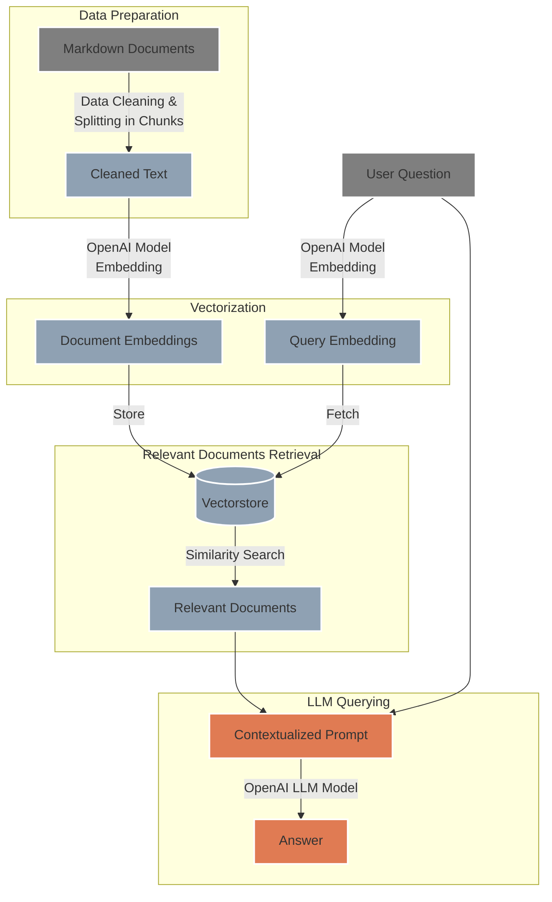

# `LLM RAG` - Streamlit RAG Language Model App 🤖

## 🌟 Overview 
This Streamlit app leverages Retrieval-Augmented Generation (RAG) by using OpenAI's Large Language Model (LLM) in conjunction with FAISS, a vector database. The app allows users to upload markdown files 📂, ask questions related to the content of these files ❓, and receive AI-generated answers based on the uploaded content 📚.

## ❓ How It Works
The LLM RAG Streamlit app is structured into several key areas, each serving a specific function within the application:

<p align="center">
  
</p>

- **Setup Knowledge Base** 📂: Upload markdown documents to establish the knowledge base.
- **Explore Knowledge Base** 🔍: Browse and manage the uploaded documents.
- **RAG Query** 💡: Pose questions to receive answers referencing the knowledge base and the model's knowledge.

Additionally, the app offers advanced settings for customization based on user needs:

<p align="center">
  
</p>

- **OpenAI Embedding Model Settings**: Select the embedding model for document vectorization.
- **OpenAI LLM Settings**: Choose the OpenAI language model variant for generating answers.
- **LLM Temperature**: Adjust the creativity of the model’s responses.
- **Max Completion Tokens**: Define the maximum length of the generated response.
- **Drop All Documents in Knowledge Base**: Clear the database by typing a confirmatory command.

## 🛠️ System Architecture
The following diagram illustrates the flow of data through the system:



## Project Structure 🏗️
The project's main directories are laid out as follows:

```
LLM-RAG/
├── .github/workflows/          # CI/CD pipeline definitions
├── configs/                    # Configuration files for the model (model names, pricing..)
├── data/                       # Data and indices used by the app (FAISS Knowledge Base)
├── docker/                     # Docker related files 
├── notebooks/                  # Jupyter notebooks for experiments
├── secrets/                    # API keys and other secrets (excluded from version control)
├── src/                        # Source code for the LLM RAG logic
├── streamlit_app/              # Streamlit app files for the Web Interface
├── tests/                      # Test cases for the application
├── .dockerignore               # Specifies ignored files in Docker builds
├── .gitignore                  # Specifies untracked files ignored by git
├── Dockerfile                  # Dockerfile for building the Docker image
├── Makefile                    # Make commands for building and running the app 🧑‍💻
├── README.md                   # Documentation and instructions
├── requirements.txt            # Python dependencies for the project
└── (additional project files and scripts)
```

## 🚀 Getting Started

To begin using the LLM RAG app, follow these simple steps:

1. **Clone the Repository:**
   ```
   git clone https://github.com/labrijisaad/LLM-RAG.git
   ```

2. **Create the Environment:**
   Set up your virtual environment using either venv or conda:
   ```
   # Using venv
   python -m venv env_llm_rag
   source env_llm_rag/bin/activate
   
   # Using conda
   conda create --name env_llm_rag
   conda activate env_llm_rag
   ```

3. **Install Dependencies:**
   Install the required dependencies by

 running:
   ```
   pip install -r requirements.txt
   ```

4. **Set Up OpenAI API:**
   Rename the example credentials file to `secrets/credentials.yml` and replace the placeholder key ('sk-xxx') with your actual OpenAI API key. You can obtain your API key by following the instructions provided in the [OpenAI documentation](https://platform.openai.com/docs/quickstart?context=python).
   ```
   rename secrets/credentials-example.yml secrets/credentials.yml
   ```

5. **Run the Streamlit App:**
   Launch the Streamlit app using either the provided Makefile command or directly via the Streamlit CLI:
   ```
   # Using Makefile
   make stream
   
   # Or directly
   streamlit run streamlit_app/main.py
   ```
## 🐳 Docker Version

The application is available as a Docker container and can be easily set up and run with a few commands. If you want to run the application using the Docker image from the public registry, ensure that you have a `secrets` directory with the necessary API keys as specified in the `secrets/credentials.yml`.

To pull and run the Docker container:

1. **Pull the Docker Image:**
   You can pull the image directly from **Google Artifact Registry** using the following command:
   ```shell
   docker pull europe-west1-docker.pkg.dev/llm-rag-application/llm-rag/llm_rag_app:latest
   ```

2. **Run the Docker Container:**
   After pulling the image, you can run it with:
   ```shell
   docker run -p 8501:8501 -v $(pwd)/secrets:/app/secrets europe-west1-docker.pkg.dev/llm-rag-application/llm-rag/llm_rag_app:latest
   ```
   This command will start the container and mount your **`secrets`** directory for the application to use.

If you prefer to use the **Makefile**, the equivalent commands are provided for convenience:

```shell
# To pull the Docker image
make docker-pull

# To run the pulled Docker image
make docker-run-pulled
```

The Streamlit app will be available at **`http://localhost:8501`** once the container is running.


## 🌐 Connect with me
<div align="center">
  <a href="https://www.linkedin.com/in/labrijisaad/">
    
  </a>
  <a href="https://github.com/labrijisaad">
    
  </a>
</div>
